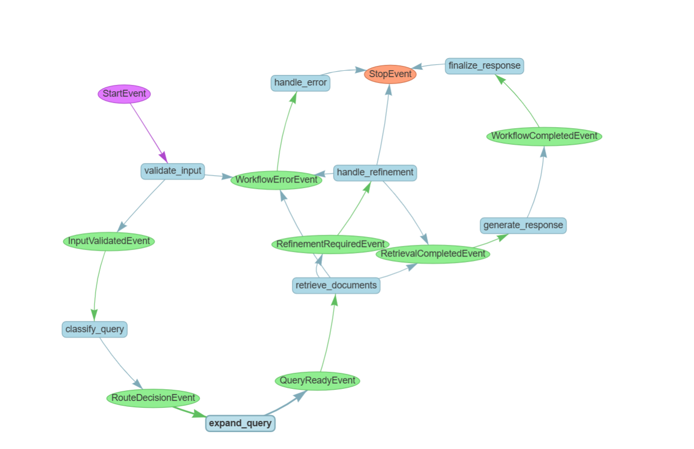

# 🧠 Event-Driven RAG Assistant

An advanced, asynchronous Retrieval-Augmented Generation (RAG) workflow built with **LlamaIndex Workflows**. This project implements a modular, event-driven architecture that intelligently routes queries, expands search contexts, and features self-correcting refinement loops to ensure highly accurate AI responses.

## 🌟 Key Features

* **Event-Driven Architecture:** Utilizes LlamaIndex Workflows (`StartEvent`, `QueryReadyEvent`, `RetrievalCompletedEvent`, etc.) for a robust and scalable pipeline.
* **Smart Query Routing:** Uses an LLM to classify user intent and dynamically routes queries to either **Semantic Search** (Pinecone) or **Structured Data Retrieval** (JSON DB).
* **Self-Refinement Loop:** Automatically detects low-confidence results or empty retrievals and re-triggers the search with expanded/refined queries (up to 3 attempts).
* **Input Validation & Guardrails:** Validates user input to prevent empty, overly long, or gibberish queries before hitting the LLM.
* **Graceful Error Handling:** Dedicated event paths for managing API failures, missing data, and providing friendly fallback responses.

## 🏗️ Workflow Architecture

Below is the generated execution graph of the workflow, showcasing the events and steps from validation to the final synthesized response:



## 🛠️ Tech Stack

* **Framework:** [LlamaIndex](https://www.llamaindex.ai/) (Core & Workflows)
* **LLM & Embeddings:** [Cohere](https://cohere.com/) (`command-r-08-2024`, `embed-multilingual-v3.0`)
* **Vector Database:** [Pinecone](https://www.pinecone.io/)
* **UI:** [Gradio](https://www.gradio.app/)

## 🚀 Quick Start


### 1. Clone the repository
```bash
git clone https://github.com/Hadasa-Fishel/tms-rag-assistant.git
cd tms-rag-assistant
```
### 2. Install dependencies
bash
pip install -r requirements.txt
(Note: Ensure you have llama-index, llama-index-utils-workflow, pinecone-client, cohere, gradio, and python-dotenv installed).

### 3. Environment Variables
``
Create a .env file in the root directory and add your API keys:

Plaintext
COHERE_API_KEY=your_cohere_key_here
PINECONE_API_KEY=your_pinecone_key_here

### 4. Run the Application
To run the terminal-based query engine and generate the workflow HTML graph:

Bash
python rag_workflow.py
To launch the interactive web UI:

Bash
python ui_app.py

### 📂 Project Structure
rag_workflow.py: The core LlamaIndex event-driven logic and state management.

ui_app.py: Gradio web interface implementation.

theme.py: Custom CSS and styling for the Gradio UI.

structured_db.json: Local knowledge base for specific rules, decisions, and warnings.